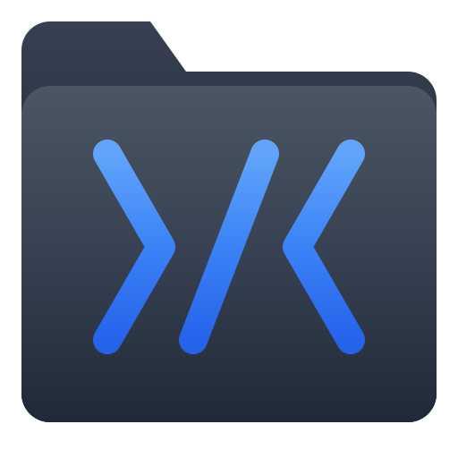

<p align="center">
  
</p>

<h1 align="center">Proj</h1>

<p align="center">
  <strong>Quickly open and organize your dev projects</strong>
</p>

<p align="center">
  A Raycast extension that scans your project directories, organizes them into collections, and lets you instantly open any project in your favorite editor.
</p>

---

## Features

- **Automatic Project Detection** - Scans directories and identifies projects by common markers like `.git`, `package.json`, `Cargo.toml`, and more
- **Collections** - Organize projects into custom collections with icons and colors
- **Smart Search** - Filter by name, collection (`#work`), language (`lang:rust`), or git org (`org:anthropic`)
- **Multiple Sources** - Scan multiple project directories with different depths
- **Recency Tracking** - See when you last opened each project
- **Language Detection** - Automatically detects project language for filtering
- **Per-Project Customization** - Set custom display names, icons, and IDE overrides

## Commands

| Command | Description |
|---------|-------------|
| **Open Project** | Browse and open projects in your IDE |
| **Manage Collections** | Create, edit, and organize project collections |

## Search Syntax

| Filter | Example | Description |
|--------|---------|-------------|
| Text | `api` | Fuzzy match project name |
| Collection | `#work` | Filter by collection |
| Language | `lang:rust` | Filter by detected language |
| Git Org | `org:anthropic` | Filter by git remote organization |
| Path | `in:~/work` | Filter by directory path |

**Built-in collections:** `#recent`, `#stale`, `#month`, `#uncategorized`

## Supported Project Types

Projects are detected by the presence of these markers:

| Marker | Ecosystem |
|--------|-----------|
| `.git` | Any version-controlled project |
| `package.json` | Node.js / JavaScript / TypeScript |
| `Cargo.toml` | Rust |
| `go.mod` | Go |
| `pyproject.toml`, `requirements.txt` | Python |
| `Gemfile` | Ruby |
| `composer.json` | PHP |
| `Package.swift` | Swift |
| `pubspec.yaml` | Dart / Flutter |
| `mix.exs` | Elixir |
| `build.sbt` | Scala |
| `pom.xml` | Java (Maven) |
| `build.gradle` | Java / Kotlin (Gradle) |
| `CMakeLists.txt` | C / C++ |
| `Makefile` | Various |

## Installation

1. Open Raycast
2. Search for "Store" and open the Raycast Store
3. Search for "Proj"
4. Click Install

Or install from source:

```bash
git clone <repository-url>
cd proj
bun install
bun run dev
```

## Configuration

### Extension Preferences

Configure in Raycast Preferences under Extensions > Proj:

| Setting | Description | Default |
|---------|-------------|---------|
| **IDE Application** | The application used to open projects | *Required* |

### Per-Project Settings

Access via `Cmd + Shift + ,` when a project is selected:

| Setting | Description |
|---------|-------------|
| **Display Name** | Custom name shown in the project list |
| **Icon** | Choose from any Raycast icon |
| **Icon Color** | Background color for the initials icon |
| **IDE Override** | Open this project with a different application |

## Actions

| Action | Shortcut | Description |
|--------|----------|-------------|
| Open in IDE | `Enter` | Opens the project in your configured IDE |
| Show in Finder | `Cmd + Enter` | Reveals the project folder in Finder |
| Copy Path | `Cmd + Shift + C` | Copies the full project path to clipboard |
| Add to Collection | `Cmd + Shift + C` | Add project to a collection |
| Project Settings | `Cmd + Shift + ,` | Opens per-project customization form |
| Delete Project | `Ctrl + X` | Permanently delete the project folder |

## Development

```bash
bun run dev       # Start development mode with hot reload
bun run build     # Build the extension
bun run lint      # Run ESLint
bun run fix-lint  # Auto-fix linting issues
bun test          # Run tests
```

## License

MIT
